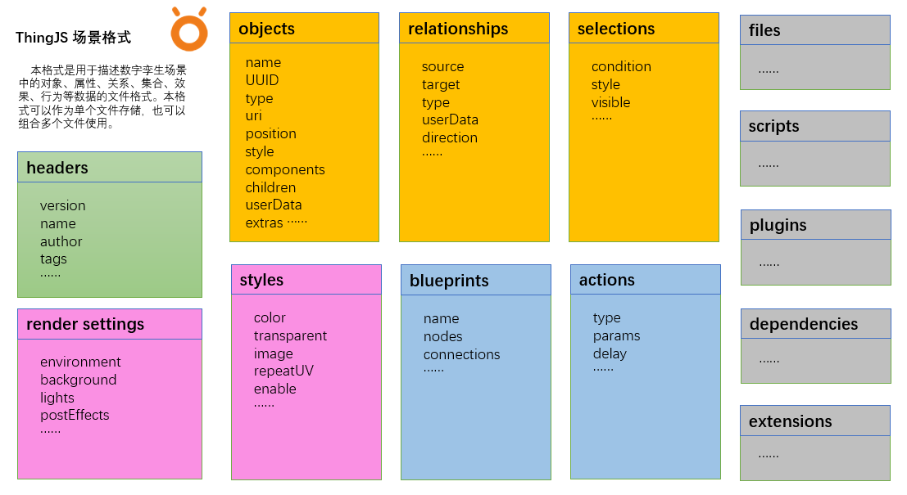

# 文件格式
<!-- format -->

`ThingJS`的场景文件格式，是用于描述数字孪生场景中的对象、关系、集合、效果、行为的`JSON`文件格式。



## 格式说明
下面是一个场景文件`JSON`的大体结构：
```javascript
{
  // 头信息
  "name": "scene01",
  "id": "972c819-ee02-11ed-bfbe-c0b5d78a0456",
  "version": "2.0",
  "description": "ThingJS Scene Format",
  "author": "uino",
  // 对象
  "objects": [],
  // 关系
  "relationships": [],
  // 渲染设置
  "rendersettings": {},
  // 效果
  "styles": [],
  // 蓝图
  "blueprints": [],
  // 选择集
  "selections": [],
  // 引入其他场景文件
  "files": [],
  // 插件
  "plugins": [],
  // 脚本
  "scripts": [],
  // 扩展
  "extensions": {}
}
```
一个场景文件可以存储上述的全部字段内容，也可以只存储其中的部分字段。只存储部分字段的文件，一般用于描述某类数据，比如：只存储效果相关的字段，当加载这个文件仅用于生效某个效果。

详细格式参考：[TSF-JSON](../../formats/TSF.jsonc)

## 应用举例
### 组合使用
`ThingJS`在实际应用中，可以通过一个场景文件，引用多个文件的组合使用，例如：
```javascript
// scene.json
{
    "name": "MyScene",
    "files": [
        "./main.json", // 主场景
        "./deploys.json", // 部署对象（采集数据）
        "./rendersettings.json", // 渲染设置
        "./blueprint.json", // 蓝图文件
    ]
}
```
使用`app.load`方法加载文件：
```javascript
// 加载场景文件
let asset = await app.load("./scenes/uino.json");

// 加载到的场景根对象
console.log(asset.root);

// 加载到的蓝图
console.log(asset.blueprints[0]);
```
在加载这个`JSON`文件后，就可以获取到多个文件中的的对象、关系、渲染设置、和蓝图等，并立即生效。


### 效果模板
可以将效果相关的文件放到一起，组成一个效果模板包，如:

```javascript
// back-to-earth.json
{
    "name": "MyTheme",
    "files": [
        "./rendersettings.json", // 渲染设置：天空盒，灯光，后期等
        "./styles.json", // 物体效果设置
        "./effect-grounds.json", // 特效地面设置
        "./effect-particle.json", // 粒子效果
    ]
}
```

> 注意，效果模板包，通常会用于不同风格的切换，所以一般不希望立即被应用到场景中，只有当需要时候才应用，以达到切换到效果的目的，需要传入`apply`参数为`false`。

```javascript
// 加载，但不立即生效
let asset = await app.load("./themes/theme.json", {apply: false});

// 在需要的时候，让其生效
asset.apply();
```

### 预制件
预制件文件，一般是包含了对象字段，以及对组件脚本、蓝图脚本引用的文件，例如：
```javascript
// spaceman.json
{
  "name": "spaceman",
  "URIs": ["./spaceman.gltf"],  

  // 对象
  "objects": [{
      "uuid": "9c0e84e81dd84fb3b8ddb3d3fe83b97f",
      "type": "Entity",
      "tags": [0],
      "uri": 0,
      "size": [1.399, 2.292, 3.439],
      "style": 0,
      "components": [
        {
          "type": "MyComp",
          "name": "mine",
          "params": {
            "speed": 100
          }
        },
        {
          "type": "YourComp",
          "name": "you"
        }
      ],
  }],

  // 脚本
  "scripts": [
    "./comp.js", // 组件脚本
    "./bpnode.js", // 蓝图节点文件    
  ]
}
```

可以通过创建一个`Entity`对象，来加载预制件：
```javascript
// 实例化预制件
let obj = new THING.Entity({
    url: "./prefabs/spaceman.json"
});
```

## 导出
导出`TSF`文件，需要通过构建一个`SceneExproter`的导出器，将需要导出的内容，添加到导出器中，然后导出。

```javascript
// 导出器
let exproter = new THING.SceneExproter();

// 添加要导出的对象
exporter.addObjects(rootObject);
exporter.addObjects(rootObject.children);

// 添加要导出的关系
let rls = app.queryRelationships(...)；
exporter.addRelationships([rls]);

// 添加要导出的对象集合
exporter.addSelections([{
    objects: rootObject.children,
    style: new THING.Style({
        opacity: 0.5,
    })
}, {
    condition: ".Entity",
    style: new THING.Style({
        "color": "red"
    })
}]);

// 添加要导出的渲染设置
exporter.addRenderSettings(app.renderSettings);

// 添加要导出的蓝图
exporter.addBluprints([{
    name: "bp01",
    url: "./bp01.json",
}, {
    name: "bp02",
    url: "./bp02.json",
}]);

// 添加要导出的文件
exporter.addFiles([
    "./scene01.json",
    "./scene02.json"
]);

// 添加要导出的插件
exporter.addPlugins([{
    name: "plug01",
    url: "./plug01.js",
    params: {name: "p1"}
},{
    url: "./plug02.js"
}]);

// 添加要导出的文件
exporter.addScripts([
    "./script1.js",
    "./script2.js"
]);

// 导出
let data = exporter.export();
```

